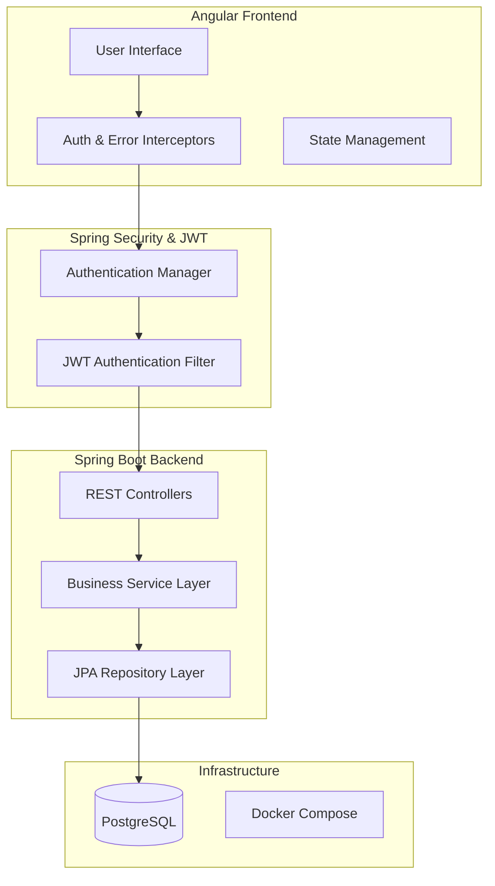

# 🏦 BNA Bank - Gestion des Actions en Défense


Ce projet est une solution d'entreprise pour la **BNA Bank** visant à centraliser et automatiser la gestion des dossiers juridiques et des actions en défense. Il offre un workflow complet allant de la création du dossier jusqu'au règlement des frais, avec une validation multi-niveaux.

---

## 🏗️ Architecture du Système

Le système repose sur une architecture moderne en couches, garantissant scalabilité et sécurité.



### Stack Technique
- **Frontend** : Angular 17+ (Projets standalone), RxJS, Vanilla CSS (Premium Design).
- **Backend** : Java 17, Spring Boot 3.2, Spring Security (JWT).
- **Persistance** : Spring Data JPA, Hibernate, PostgreSQL.
- **DevOps** : Docker, Docker Compose, Jenkins (CI/CD Pipeline).

---

## 🚀 Fonctionnalités Clés

### 1. Gestion des Dossiers
- Création et suivi du cycle de vie des dossiers juridiques.
- Attribution des auxiliaires de justice (Avocats, Huissiers, Experts).
- Moteur d'analyse de dossiers propulsé par l'IA.

### 2. Workflow de Paiement
Validation multi-niveaux pour les frais de justice :
1. **Chargé de Dossier** : Saisie de la demande de frais.
2. **Pré-validateur** : Vérification technique.
3. **Validateur** : Approbation finale et envoi vers la Trésorerie.

### 3. Sécurité (RBAC)
Accès contrôlé via 4 rôles majeurs :
- `ROLE_ADMIN` : Gestion des utilisateurs et configuration système.
- `ROLE_CHARGE_DOSSIER` : Gestion opérationnelle des dossiers.
- `ROLE_PRE_VALIDATEUR` : Étape de validation intermédiaire.
- `ROLE_VALIDATEUR` : Autorité finale.

---

## ⚙️ Installation et Démarrage

### Pré-requis
- Docker & Docker Compose
- JDK 17
- Node.js & Angular CLI

### 1. Base de données & Outils
Lancez PostgreSQL et pgAdmin via Docker :
```bash
docker-compose up -d
```
- **pgAdmin** : http://localhost:5050 (Login: `admin@bna.com` / `password`)

### 2. Démarrage Backend
```bash
cd backend
mvn spring-boot:run
```
Le serveur écoute sur `http://localhost:8082`.
- Documentation API : `http://localhost:8082/swagger-ui.html`

### 3. Démarrage Frontend
```bash
cd frontend
npm install
npm run start
```
Accès : `http://localhost:4200`.

---

## 🔑 Identifiants de Test

| Rôle | Username | Password |
|------|----------|----------|
| **Administrateur** | `admin` | `admin123` |
| **Chargé de Dossier** | `charge@bna.tn` | `charge@bna.tn` |
| **Pré-validateur** | `prevalidateur@bna.tn` | `prevalidateur@bna.tn` |
| **Validateur** | `validateur@bna.tn` | `validateur@bna.tn` |

---

## 📄 Licence
© 2026 BNA Bank - Tous droits réservés.
